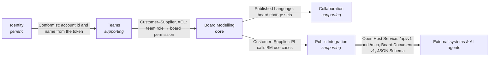
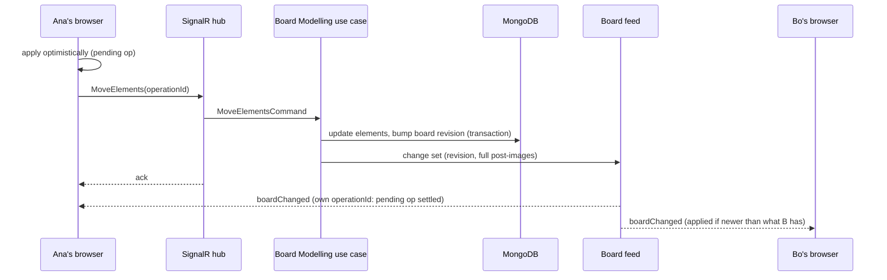

# EventStorming

A web-based, real-time, collaborative [EventStorming](https://www.eventstorming.com/) board. Teams model
business processes together on an infinite board of stickies (Domain Events, Commands, Actors, Policies,
Read Models, External Systems, Aggregates, Hot Spots, Opportunities), with swimlanes, boundaries,
pivotal events and arrows, at three levels: Big Picture, Process Modelling and Software Design.
Other systems and AI agents build boards through a public REST API or an MCP server, and their
changes appear live.

- **Collaborate live:** see who is on the board, their cursors, what they are editing and what they are dragging. Changes merge deterministically, and the board resyncs cleanly after a dropped connection.
- **Model fast:**
  - a type's letter adds a sticky where the pointer is; `Tab` continues the timeline;
  - double-click to quick-add; drag from the palette;
  - multi-select, copy/paste (including between boards, or lines of text as events), and per-person undo/redo;
  - search and filter, a legend, and keyboard shortcuts (`?`).
- **Teams:** accounts, teams with Owner / Editor / Viewer roles, and invitations by link or email. A dashboard to create, rename, duplicate, archive and restore boards.
- **Import and export** a board as JSON (the Board Document), or export it as an SVG image.
- **Public API** (`/api/v1`):
  - API keys with scopes;
  - one-call import with automatic timeline layout;
  - idempotency keys, per-key rate limits, and RFC 9457 errors that name the field and the fix.
- **MCP server** (`/mcp`): AI agents (Claude, VS Code, Cursor and other MCP clients) draw and edit boards with tools such as `create_board` and `add_to_board`, with the modelling guide as a resource and ready-made prompts.

## Contents

- [Quick start](#quick-start)
- [Developing locally](#developing-locally)
- [Tests](#tests)
- [Architecture](#architecture)
- [Folder structure](#folder-structure)
- [How to add an element type](#how-to-add-an-element-type)
- [How to add a use case (slice)](#how-to-add-a-use-case-slice)
- [Configuration](#configuration)
- [Documentation](#documentation)
- [Limitations](#limitations)

## Quick start

You need Docker with Compose.

```sh
docker compose up --build            # MongoDB, Mailpit, the API and the web app
docker compose run --rm api seed     # optional: a demo account, team and sample board
```

| What | Where |
|---|---|
| Web app | http://localhost:3000 |
| API reference (Scalar) | http://localhost:5080/docs |
| Public API index | http://localhost:5080/api/v1 |
| MCP server (for agents; needs an API key) | http://localhost:5080/mcp |
| Mailpit (invitation emails) | http://localhost:8025 |

The seed creates `demo@eventstorming.local` with the password `eventstorming` (set `SEED_DEMO_PASSWORD`
to choose another), a "Demo team", and the "Online food ordering" Big Picture board.

No secrets are stored in the repository. In Development the API generates a JWT signing key into the
`keys` volume on first start. Copy `.env.example` to `.env` to change ports or anything else. For
example, if port 8025 is taken, set `MAILPIT_UI_PORT=8026`.

## Developing locally

Run MongoDB and Mailpit in Docker, and the API and web app on the host:

```sh
docker compose up -d mongo mailpit

# API on http://localhost:5080 (needs the .NET 10 SDK)
dotnet run --project server/src/driving-adapters/EventStorming.Host --launch-profile http

# Web app on http://localhost:3000 (needs Node 22.13+ or 24+)
cd web
npm install
npm run dev
```

Seed the local database with `./scripts/seed.sh` (or `./scripts/seed.ps1` on Windows). The scripts use
the Docker stack if it is running, and the local API otherwise. MongoDB is published on host port
**27018**, since a local installation often takes 27017.

## Tests

| Suite | What it covers | Run |
|---|---|---|
| Behaviour specs (Reqnroll + xUnit v3) | Every use case against in-memory fakes, in Given/When/Then | `dotnet test --project server/tests/EventStorming.Specs` |
| Architecture (ArchUnitNET) | Rings, context independence, slice shape, no tactical DDD, composition | `dotnet test --project server/tests/EventStorming.Architecture.Tests` |
| MongoDB integration (Testcontainers) | Every store adapter against a real replica set | `dotnet test --project server/tests/EventStorming.Persistence.MongoDb.IntegrationTests` |
| Host integration (WebApplicationFactory + Testcontainers) | HTTP, SignalR and MCP end to end: sessions, errors, the public API, live changes between two people, an agent drawing through the official MCP client, schema drift | `dotnet test --project server/tests/EventStorming.Host.IntegrationTests` |
| Web (Vitest + React Testing Library) | Sync model, realtime middleware (fake hub), commands and undo, clipboard, export, the editor from the keyboard, render counts, module boundaries | `cd web && npm test` |
| End to end (Playwright) | Two people sign up, share a team and a board, and see each other's changes live | `cd tests/e2e && npm install && npx playwright install chromium && npm test` (with the stack running) |

The integration suites start their own MongoDB containers, so Docker must be running. The end-to-end
test signs up two new accounts per run; the API allows 10 sign-ins or sign-ups per minute per client
address.

After a deliberate change to the Board Document, regenerate the published schema with
`UPDATE_PUBLISHED_SCHEMA=1 dotnet test --project server/tests/EventStorming.Host.IntegrationTests`,
and review the diff to `docs/schemas/board-document.v1.schema.json`.

## Architecture

Hexagonal, organised as vertical slices, with strategic DDD only: bounded contexts, a context map and
anti-corruption layers, but no aggregates, value objects or repositories. The decisions and their
reasons are in [`docs/adr`](docs/adr).

### Bounded contexts



| Context | Owns |
|---|---|
| **Identity** | Accounts, passwords, sessions (access and rotating refresh tokens) |
| **Teams** | Teams, members, roles, invitations |
| **Board Modelling** (core) | Boards, elements, connections, the element-type registry, the Board Document, auto-layout |
| **Collaboration** | Presence: participants, cursors, editing focus, drag previews (in memory) |
| **Public Integration** | API keys and scopes, idempotency records |

Each context is one core assembly with no references to the other contexts. What one context needs
from another is a port it owns, implemented by an adapter. For example, Board Modelling asks
`IBoardAccess` for a `BoardPermission`, and the MongoDB adapter answers from team roles and API-key
scopes: that adapter is the anti-corruption layer.

### How a change flows



The public API and the MCP server call the same use cases, so their changes reach open boards the same way.

## Folder structure

```
server/
  src/
    application/                 the cores: one assembly per bounded context
      EventStorming.SharedKernel   Failure, Actor, IClock, paging
      EventStorming.Identity       Model/  Shared/  Slices/<UseCase>/
      EventStorming.Teams
      EventStorming.BoardModelling also Layout/ (auto-layout) and Drafting/ (Board Document planning)
      EventStorming.Collaboration
      EventStorming.PublicIntegration
    driving-adapters/
      EventStorming.Api.Rest       /api/app (web app) and /api/v1 (public), Problem Details, idempotency
      EventStorming.Realtime.SignalR  the board hub and the feed relay
      EventStorming.Mcp            the MCP server: drawing tools, resources and prompts for agents
      EventStorming.Host           composition root, configuration, seeding
    driven-adapters/
      EventStorming.Persistence.MongoDb  stores per slice, the ACL, indexes
      EventStorming.Security       password hashing, JWTs, token and key secrets
      EventStorming.Email.Smtp     invitation emails
      EventStorming.ElementTypes.Json  the element-type registry (element-types.json)
      EventStorming.Presence.InMemory  who is on which board
      EventStorming.Broadcasting(.Transport)  change sets and presence onto the board feed
  tests/                         specs, architecture, MongoDB integration, host integration
web/
  src/
    app/                         Next.js routes; they compose modules
    modules/
      identity/  teams/  public-integration/
      board-modelling/           board (sync model), editor, canvas, palette, legend, search,
                                 history, clipboard, shortcuts, documents, catalog, notation
      collaboration/             realtime (middleware, hub client), presence
    shared/                      API base, problems, UI primitives
    store/                       the Redux store
tests/e2e/                       Playwright
docs/                            API reference, LLM guide, glossary, ADRs, schema, examples
scripts/                         seed.sh, seed.ps1
```

## How to add an element type

Element types are data. Adding one changes no server or web code.

1. Add an entry to `server/src/driven-adapters/EventStorming.ElementTypes.Json/element-types.json`:

   ```json
   {
     "id": "question",
     "name": "Question",
     "category": "sticky",
     "renderer": "sticky",
     "color": "#FFD8A8",
     "textColor": "#1B1B1F",
     "icon": "help",
     "defaultSize": { "width": 160, "height": 100 },
     "levels": ["big-picture"],
     "shortcut": "Q",
     "maxTextLength": 300,
     "canBePivotal": false,
     "layoutRole": "item",
     "description": "Something the group wants to ask an expert.",
     "whenToUse": "When nobody in the room knows the answer.",
     "writingRule": "A question: \"Who approves refunds?\"",
     "examples": ["Who approves refunds?"]
   }
   ```

   - `id`: kebab-case and unique.
   - `shortcut`: unique.
   - `levels`: the levels whose palette offers the type (every type can still be placed anywhere).
   - `renderer`: `sticky`, `lane` or `area`.
   - `layoutRole`: `item`, `lane` or `boundary`, which decides how auto-layout treats it.
   - `icon`: a name from `web/src/shared/ui/Icon.tsx`; an unknown name draws a square.
2. Restart the API. The registry is validated at startup, and a mistake stops the API with a message naming the type and the problem. To use a file outside the build, point `ElementTypes__Path` at it.
3. That's all. The palette, legend, shortcuts, help overlay, validation, the JSON Schema's `enum` and the public API pick it up. The specs use their own registry fake, so they are unaffected.

## How to add a use case (slice)

Take "revoke an invitation" in Teams as the model (`server/src/application/EventStorming.Teams/Slices/RevokeInvitation`):

1. **Contract**: `Slices/<Name>/<Name>.cs` holds:
   - the command or query record (it carries the `Actor`);
   - a `<Name>Result` implementing `IUseCaseResult` with `Succeeded` / `Failed` factories;
   - the handler interface `I<Name>CommandHandler`;
   - the store port `I<Name>Store`, with only the reads and writes this use case needs.
2. **Handler**: `Slices/<Name>/<Name>Handler.cs` holds the sealed handler, plus a FluentValidation validator if the input needs one. Validator failures carry error codes and a `.WithFix(...)`. The handler:
   - checks authorization (through the context's access port);
   - applies the rules and calls the store;
   - broadcasts if content changed;
   - returns failures, never throws for expected outcomes.
3. **Register** the handler (and validator) in the context's `*ServiceExtensions`.
4. **Store adapter**: implement the port in the MongoDB adapter (e.g. `Persistence.MongoDb/Teams/TeamsStores.cs`) and register it in `MongoDbServiceExtensions`.
5. **Driving adapter**: map an endpoint in `Api.Rest` (or a hub method), translating the request into the command and `Problems.From(result, http)` for failures.
6. **Tests**: a scenario in `server/tests/EventStorming.Specs/Features/<Context>/` with step definitions using the in-memory fakes, and a store test in the MongoDB integration suite. The architecture tests check the slice's shape automatically.

## Configuration

The API reads `appsettings.json`, then environment variables (`Section__Key`).

| Setting | Default | Meaning |
|---|---|---|
| `Mongo__ConnectionString` | `mongodb://localhost:27018/?replicaSet=rs0&directConnection=true` | A replica set is required (transactions). |
| `Mongo__Database` | `eventstorming` | |
| `Jwt__SigningKey` | empty | Base64, at least 32 bytes. Required in Production; generated into `Keys__Directory` otherwise. |
| `Keys__Directory` | `<content root>/.keys` | Where a development signing key is kept. |
| `Cors__AllowedOrigins__0` | `http://localhost:3000` | The web app's origin (credentials allowed). |
| `Cors__PublicApiOrigins__0` | none | Browser origins allowed to call `/api/v1`. |
| `RestApi__PublicApiPermitsPerMinute` | 300 | Requests per API key per minute. |
| `RestApi__SignInPermitsPerMinute` | 10 | Sign-ins and sign-ups per client address per minute. |
| `RestApi__SecureCookies` | `true` (`false` in Development) | The `Secure` flag on the refresh cookie. |
| `Smtp__Host`, `Smtp__Port`, `Smtp__From` | | Invitation emails; Compose uses Mailpit. |
| `WebApp__BaseUrl` | `http://localhost:3000` | Used in invitation links. |
| `ElementTypes__Path` | embedded registry | Another `element-types.json` to load. |

The web app has one setting, `NEXT_PUBLIC_API_URL` (default `http://localhost:5080`). It is baked in at build time; see `web/.env.example`.

## Documentation

- [`docs/api.md`](docs/api.md): the public API: authentication, conventions, every endpoint with examples, errors, idempotency, rate limits, versioning.
- [`docs/mcp.md`](docs/mcp.md): the MCP server: connecting Claude Code, VS Code, Cursor and other clients, the tools, resources and prompts.
- [`docs/llm-guide.md`](docs/llm-guide.md): for LLM agents: the notation, the Board Document, a worked example, common mistakes. Also served at `/docs/llm-guide.md` and as the MCP resource `eventstorming://guide`.
- [`docs/glossary.md`](docs/glossary.md): the ubiquitous language.
- [`docs/adr/`](docs/adr): architecture decision records.
- [`docs/schemas/board-document.v1.schema.json`](docs/schemas/board-document.v1.schema.json): the Board Document's JSON Schema.
- [`docs/examples/food-ordering.board.json`](docs/examples/food-ordering.board.json): a complete Big Picture board.
- [`docs/phase-0-plan.md`](docs/phase-0-plan.md): the original design and the reasoning behind it.

## Limitations

- **One API instance.** Presence and the board feed are in memory; scaling out needs a SignalR backplane (ADR 4).
- **Last writer wins per field.** There is no character-level merge when two people type into the same sticky at once; the editing indicator makes it visible.
- **Arrows are straight** and their labels can only be set through the API or a Board Document.
- **Export** is JSON and SVG; there is no PNG export.
