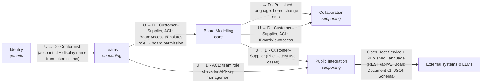

# Phase 0 — Research and plan

**Status:** draft for review, 2026-09-25. No code has been written.

Sections 4–7 hold the parts that need your decision: conflicts with hex-commerce, tensions inside the
brief, assumptions, and open questions. Sections 1–3 hold the research and the design they rest on.

---

## 1. hex-commerce conventions (the backend template)

Source: `C:\Users\Nikhil\Documents\GitProjects\hex-commerce`. Only the IdentityAccess context has a
real hexagon; the other nine storefront contexts are UI on dummy data.

### 1.1 Solution and folder structure

```
hex-commerce/
├─ server/
│  ├─ HexCommerce.slnx                 XML solution format; folders mirror the rings
│  ├─ global.json                      test runner = Microsoft.Testing.Platform
│  ├─ src/
│  │  ├─ application/                  THE RING IS THE FOLDER (arch tests classify projects by it)
│  │  │  ├─ HexCommerce.Models/        leaf: mutable POCO classes, one folder per context
│  │  │  ├─ HexCommerce.Events/        leaf: IDomainEvent, IEventHandler<T>, past-tense sealed records
│  │  │  └─ HexCommerce.Services/      the application core: ports + use cases
│  │  ├─ driving-adapters/
│  │  │  ├─ HexCommerce.API/           host + composition root + controllers (Sdk.Web)
│  │  │  └─ HexCommerce.Listener.RabbitMQ/   non-host driving adapter (queue consumer)
│  │  └─ driven-adapters/              one project per technology
│  │     ├─ HexCommerce.Persistance.Postgres/   EF Core write side (note: "Persistance" spelling)
│  │     ├─ HexCommerce.Queries.Postgres/       Dapper read side
│  │     ├─ HexCommerce.Projections.Postgres/   event handlers that maintain read models
│  │     ├─ HexCommerce.Authentication.Jwt/     JWT issuing + PBKDF2 hasher + JwtBearer setup
│  │     ├─ HexCommerce.Authorization/          ICurrentUserProvider over IHttpContextAccessor
│  │     ├─ HexCommerce.EMail/                  MailKit SMTP (Mailpit in dev)
│  │     ├─ HexCommerce.EventDispatching/       in-process IEventDispatcher
│  │     ├─ HexCommerce.Messaging.RabbitMQ/ + .Transport/   publisher + shared wire/topology
│  │     ├─ HexCommerce.SystemClock/
│  │     └─ HexCommerce.APIDocumentation.Swagger/
│  ├─ database/postgres/*.sql          schema, stored procedures, seed, test data
│  └─ tests/
│     ├─ HexCommerce.Services.Specs/          Reqnroll BDD over the handlers
│     └─ HexCommerce.Architecture.Tests/      ArchUnitNET
├─ client/web-app/                     Next.js 16, React 19, RTK 2, Tailwind 4, zod
├─ client/tests/architecture-tests/    ArchUnitTS + Vitest
├─ tests/end-to-end-tests/             Playwright + playwright-bdd, page objects, asserts on the DB
└─ ops/dev-services/                   docker compose for RabbitMQ + Mailpit (Postgres runs natively)
```

### 1.2 How slices are organized

A use case is spread over **two folders** inside `HexCommerce.Services/<Context>/`:

| Folder | Contents (exactly these, enforced) |
|---|---|
| `Ports/Input/{Commands\|Queries}/<Name>/` | `I<Name><Kind>Handler` (one `Handle(msg, CancellationToken) → Task<<Name>Result>`), `<Name><Kind>` public record, `<Name>Result` class |
| `UseCases/<Name>/` | `<Name><Kind>Handler` (public, unsealed), optional `<Name><Kind>Validator : AbstractValidator<<Name><Kind>>` |

`<Name>Result` is a plain class with a private constructor, `Succeeded(...)` / `Failed(params string[])`
factories, `Success`, and `Errors : IReadOnlyList<string>`. Slices may not reference another slice or
another slice's port. The architecture suite discovers use cases from the `I*Handler` names, so a new
slice is covered without editing any test.

### 1.3 Ports and adapters: definition and naming

- **Driving ports** = the `Ports/Input` triplet above.
- **Driven ports** = interfaces in `Ports/Output/<Category>/I<Name>` with record DTOs beside them, e.g.
  `Persistance/IUserRepository`, `Authentication/IJwtTokenGenerator`, `Authentication/IPasswordHasher`,
  `Clock/ISystemClock`, `Email/IEmailSender`, `Events/IEventDispatcher`,
  `Queries/IUserProfileQuery` + `Queries/ReadModels/UserProfileReadModel`.
- Driven ports are **shared by every use case in the context**. A rule requires persistence ports to be
  `I*Repository`, "named after the aggregate they store".
- Adapters: public class `<Tech><Port>` (`SmtpEmailSender`, `Pbkdf2PasswordHasher`) implementing the port.
  Adapters may declare only *internal* interfaces. Event handlers are `internal sealed`, in a `Handlers`
  or `Consumers` namespace. Driven adapters never reference each other, except for a `<Name>.Transport`
  sibling that holds a shared wire format and must not reference the core.

### 1.4 DI wiring

- Every project except the host exposes **exactly one** `public static class <X>ServiceExtensions` with
  `AddHexCommerce<X>(this IServiceCollection, <X>Options)`. This is enforced by the arch tests.
- `Program.cs` is the only composition root. It binds option records (`JwtOptions`, `SmtpOptions`,
  `RabbitMqOptions`) from configuration, fails fast when a section is missing, and chains the
  `AddHexCommerce*` calls with a comment on each.
- Handlers are scoped and validators are singletons. Adapters that share a resource use `TryAdd`.

### 1.5 Validation and error handling

- FluentValidation in the core. The handler validates first, then returns `Result.Failed(messages)` with
  every failure at once (`Cascade(Stop)` per rule, so one message per field).
- Expected business failures are `Failed("User not found.")`, not exceptions. Sign-in failures are
  deliberately vague to prevent account enumeration.
- Side effects run after the commit, through events. Handlers of those events log and swallow errors so
  a committed request is never reported as failed.
- Controllers map `!Success` to `BadRequest(result.Errors)`, `Unauthorized(...)` or `NotFound(...)`, which
  return **bare string arrays**. Model-binding failures return ASP.NET ProblemDetails, so there are two
  error shapes. There are no error codes, no field names, and no global exception handler.

### 1.6 Testing approach and naming

- **Specs** (Reqnroll + xUnit v3 + Shouldly + Moq). There is one `.feature` per use case, with a
  `Background`, a `Scenario Outline` for validation, and an "Every invalid detail is reported at once"
  scenario. A per-feature `<Name>Context` class (injected by Reqnroll) builds the real handler with its
  real validator and fakes. The fakes are Moq mocks backed by lists (`InMemoryUserRepository` with
  `Seed`, `Object` and state), plus `FixedSystemClock` and `RecordingEventDispatcher`. Step bindings
  use regex.
- **Architecture tests** (ArchUnitNET). They are discovery-driven (no hand-maintained lists) and carry
  guards against vacuous passes. They cover rings, core purity (only BCL, DI abstractions and
  FluentValidation), the shape of each use case contract, slice isolation, port hygiene, the
  ServiceExtensions shape, event rules, cycles, and "every project is in the .slnx". Test methods are
  sentence-cased with underscores: `The_application_core_never_depends_on_an_adapter`.
- **E2E** (Playwright + playwright-bdd). The suite provisions its own database, uses its own ports,
  page objects, and a fixture that cleans up the users it creates. It asserts directly against the
  database.
- **Not present:** Testcontainers integration tests, and frontend unit or component tests.

### 1.7 Frontend conventions (reference only)

- Contexts are route groups under `app/(modules)/(<context>)/`, each with:
  - `application/{entities, handlers/{commands,queries}, ports/{input,output}, services}`
  - `config/dependency-injection.ts` (a `DIContainer` singleton keyed by port name)
  - `driven-adapters/{redux,rest,cookie}`
  - `driving-adapters/react/{hooks,providers}`
  - `(presentation)/`
- File names are kebab-case with role suffixes: `*.handler.ts`, `*.port.ts`, `*.adapter.ts`,
  `*.slice.ts`, `use-*.hook.ts`. Components are PascalCase.
- There is one root store with one reducer per module. Redux is an *output adapter* behind store ports.
  Hooks call `store.subscribe` and copy state into `useState`. The core imports no npm package. There is
  no RTK Query.
- The URL's first segment must be the context name. A declared `CONTEXT_MAP` is asserted by the arch
  tests.

### 1.8 Keep / adapt / drop

| hex-commerce convention | Decision |
|---|---|
| Ring = folder (`application/`, `driving-adapters/`, `driven-adapters/`), `.slnx`, one project per technology | **Keep** |
| One `*ServiceExtensions` per project, fail-fast options records, `TryAdd` for shared resources | **Keep** |
| `I<Name>CommandHandler` / `<Name>Command` / `<Name>Result` (private ctor, `Succeeded`/`Failed`) / `<Name>CommandValidator` naming | **Keep** |
| Slice split across `Ports/Input/...` and `UseCases/...` | **Adapt**: one folder per slice (conflict C3) |
| Shared `I*Repository` ports per context | **Drop**: narrow per-slice ports (C2) |
| `Events` assembly, `IEventDispatcher`, event-driven projections | **Drop** (C1) |
| Mutable model classes | **Adapt**: immutable records (C4) |
| `Errors: string[]` + bare arrays over HTTP | **Adapt**: structured failures → RFC 9457 (C5) |
| `.Transport` sibling pattern for a technology shared by a driving and a driven adapter | **Keep**, reused for real-time fan-out (§3.8) |
| Arch tests: discovery-driven, guarded against vacuous passes | **Keep and extend**: add "no tactical DDD" and "no cross-context references" rules |
| Reqnroll BDD for handler tests, per-feature context class, `FixedSystemClock` | **Keep**. Replace the Moq-backed fakes with hand-written in-memory fakes (C11) |
| Playwright + playwright-bdd + page objects, isolated DB/ports | **Keep**, on Docker instead of native Postgres |
| Frontend hexagon (DIContainer, store ports, handler classes) | **Drop** in favour of Redux-centric feature slices (C10). Keep route groups, the naming suffixes, and ArchUnitTS boundary tests |

---

## 2. EventStorming glossary

These terms are used unchanged in code, UI and docs. Type ids are the registry keys.

### 2.1 Element types

| Name (UI) | Type id | Meaning | Writing rule | Default look |
|---|---|---|---|---|
| **Domain Event** | `domain-event` | Something that happened that domain experts care about. The backbone of the timeline. | Past tense: "Order Placed" | orange `#FFA94D`, 160×100 |
| **Command** | `command` | A decision or intention that causes events. | Imperative: "Place Order" | blue `#74C0FC` |
| **Actor** | `actor` | A person, role or group that issues a command. | Noun: "Customer" | small yellow `#FFE066`, 120×72 |
| **Policy** | `policy` | Reactive logic between an event and a command. Automated or human. | "Whenever X, then Y" | lilac `#D0BFFF` |
| **Read Model** | `read-model` | Information an actor needs in order to decide. | Noun phrase: "Menu with prices" | green `#8CE99A` |
| **External System** | `external-system` | A system outside our control that receives commands or emits events. | Name: "Payment Provider" | pink `#FFA8C5` |
| **Aggregate / Constraint** | `aggregate` | The thing that accepts or rejects a command and enforces rules, producing events. | Noun: "Order" | large pale yellow `#FFF3BF`, 240×160 |
| **Hot Spot** | `hot-spot` | A question, risk, problem or disagreement. Mark it now and resolve it later. | Question or statement | magenta `#F783AC`, tilted |
| **Opportunity** | `opportunity` | An idea for improvement. | Statement | light mint `#C3FAE8` |

Each type also has an icon and a text label, so meaning never depends on color alone. Text color is
chosen per type for ≥ 4.5:1 contrast.

### 2.2 Board structures

| Term | In code | Meaning |
|---|---|---|
| **Timeline** | the board's x-axis | The board reads left to right in time. Order is position; the board has no separate sequence field. |
| **Pivotal Event** | `isPivotal` flag on types whose registry entry allows it (Domain Event) | A key event marking the transition between phases. It is drawn with a heavy border and a vertical divider line. |
| **Swimlane** | element type `swimlane` (structure) | A horizontal band separating parallel flows, actors or departments. |
| **Boundary** | element type `boundary` (structure) | A labeled area around the elements of one candidate bounded context. The code never names this type `BoundedContext`, so it cannot be confused with this tool's own bounded contexts. |
| **Connection** | `Connection` | An optional directed arrow between two elements. The UI calls it an "arrow". |

### 2.3 Levels

| Level | Id | Purpose | Default palette (every other type stays under "More") |
|---|---|---|---|
| **Big Picture** | `big-picture` | Explore a whole business line with a large, mixed group. Surfaces hot spots, pivotal events and emerging boundaries. | Domain Event, Hot Spot, Actor, External System, Opportunity, Swimlane, Boundary |
| **Process Modelling** | `process-modelling` | Model one process with the grammar: Actor + Read Model → Command → System → Domain Event → Policy → Command. | Domain Event, Command, Actor, Policy, Read Model, External System, Hot Spot, Swimlane |
| **Software Design** | `software-design` | Design the implementation: aggregates, the commands they accept, the events they emit, and context boundaries. | Domain Event, Command, Aggregate/Constraint, Policy, Read Model, Actor, External System, Hot Spot, Boundary |

Palettes are data (the `levels` field on each registry entry), not code.

### 2.4 Workshop flow and how the tool supports it

| Step | What happens | Tool support |
|---|---|---|
| 1. **Chaotic exploration** | Everyone writes domain events in parallel. Duplicates are fine and order is loose. | `E` then type then Enter; double-click quick-add; live cursors; no locks |
| 2. **Enforce the timeline** | Sort left to right, merge duplicates, mark pivotal events, add swimlanes. | Marquee and group move, search to find duplicates, pivotal toggle, swimlanes |
| 3. **People and systems** | Add actors and external systems. | Palette and shortcuts `A` / `X` |
| 4. **Explicit walkthrough** | Narrate the story left to right and fill gaps. | Fit-to-content, search, highlight by type, cursors to point at things |
| 5. **Problems and opportunities** | Add hot spots and opportunities, then review them. | `H` / `O`; filter to Hot Spots to review them |

Arrow (dot) voting is not in the MVP.

### 2.5 Product vocabulary

| Term | Context | Meaning |
|---|---|---|
| **Account** | Identity | A person who can sign in (email + password). |
| **Session** | Identity | A signed-in period: a short-lived access token plus a rotating refresh token. |
| **Team**, **Member**, **Role** (Owner / Editor / Viewer), **Invitation** | Teams | Who may see and change which boards. |
| **Board** | Board Modelling | A shared canvas at one level, owned by a team. It can be *archived* and *restored*. |
| **Element** | Board Modelling | Anything placed on a board: stickies and structures. Friendly UI copy says **sticky** for sticky-category elements; code, API and docs say Element. |
| **Element Type**, **Registry**, **Palette**, **Legend** | Board Modelling | The notation, defined as data. |
| **Revision** | Board Modelling | A per-board counter, incremented on every change. It is a watermark for resync. |
| **Version** | Board Modelling | A per-element counter used for last-writer-wins. |
| **Board Document** | Public Integration | The published JSON format for export, import and declarative bulk. |
| **Participant**, **Presence**, **Cursor**, **Editing indicator**, **Drag preview** | Collaboration | Who is here and what they are doing right now. All of it is ephemeral. |
| **API Key**, **Scope** (`read`, `write`), **Idempotency Key** | Public Integration | How external systems and LLMs authenticate and retry safely. |

---

## 3. Design

### 3.1 Bounded contexts and subdomains

I propose one change to the starting contexts: **split "Identity & Teams" into Identity and Teams.**
Authentication is a generic subdomain, the part you would swap for an external identity provider behind an
ACL. Team membership and roles are a supporting subdomain with their own language (member, role,
invitation). The two change for different reasons.

| Context | Subdomain | Owns | Language |
|---|---|---|---|
| **Board Modelling** | **Core** | Boards (catalog and content), elements, connections, the element-type registry, Board Document import/export, auto-layout | board, level, element, type, pivotal, swimlane, boundary, connection, revision, version |
| **Collaboration** | Supporting | Presence, cursors, editing indicators, drag previews, joining and leaving a board, fan-out of changes | participant, cursor, focus, join, resync |
| **Teams** | Supporting | Teams, membership, roles, invitations (link and email) | team, member, role, invitation |
| **Public Integration** | Supporting | API keys and scopes, idempotency, rate limits, the Open Host Service and Published Language (REST v1 + Board Document + JSON Schema) | API key, scope, idempotency key, board document |
| **Identity** | Generic | Accounts, credentials, sessions (access and refresh tokens) | account, sign up, sign in, session |

**Shared Kernel:** a deliberately tiny, technical assembly. It holds `Failure`/`FailureKind`, `Actor`
(who is acting: account or API key, with scopes), `IClock`, and cursor paging. It contains no domain
concepts.

### 3.2 Context map



| Upstream → Downstream | Pattern | Mechanism |
|---|---|---|
| Identity → Teams, Collaboration | Conformist | Downstream contexts use the account id and display name from the authenticated `Actor`. They never read Identity's collections. |
| Teams → Board Modelling | Customer–Supplier + **Anti-Corruption Layer** | Board Modelling owns the port `IBoardAccess.PermissionFor(boardId, actor)` → `BoardPermission { None, View, Edit }`. Its adapter translates team role and API-key scopes into that permission. Board Modelling never sees a `Role`. |
| Board Modelling → Collaboration | **Published Language** | Board Modelling announces committed changes through `IBoardChangeBroadcaster` as `BoardChangeSet` records (full post-images). Collaboration fans them out unchanged. |
| Board Modelling → Public Integration | Customer–Supplier | The public API adapter calls Board Modelling's driving ports and translates the Board Document to and from commands. |
| Public Integration → external systems / LLMs | **Open Host Service + Published Language** | Versioned REST, the Board Document, a JSON Schema, and the Problem Details catalogue. Consumers are conformists. |
| All contexts ↔ Shared Kernel | Shared Kernel | Technical only (see above). |

Core contexts have **no project references to each other**. Every cross-context need is a port owned by
the downstream context and implemented by an adapter. That adapter is the ACL.

### 3.3 Backend solution layout

```
event-storming/
├─ server/
│  ├─ EventStorming.slnx · global.json · Directory.Build.props · Directory.Packages.props
│  ├─ src/
│  │  ├─ application/                          ← the core: BCL + FluentValidation + DI.Abstractions only
│  │  │  ├─ EventStorming.SharedKernel/
│  │  │  ├─ EventStorming.Identity/
│  │  │  ├─ EventStorming.Teams/
│  │  │  ├─ EventStorming.BoardModelling/
│  │  │  ├─ EventStorming.Collaboration/
│  │  │  └─ EventStorming.PublicIntegration/
│  │  ├─ driving-adapters/
│  │  │  ├─ EventStorming.Host/                 Sdk.Web composition root: config, CORS, auth schemes, OpenAPI+Scalar, health, `seed` verb
│  │  │  ├─ EventStorming.Api.App/              REST for the web app (/api/app/*, JWT, refresh cookie)
│  │  │  ├─ EventStorming.Api.Public/           REST v1 (/api/v1/*, API keys, idempotency, rate limits, Board Document mapping)
│  │  │  └─ EventStorming.Realtime.SignalR/     BoardHub + consumer of the change feed
│  │  └─ driven-adapters/
│  │     ├─ EventStorming.Persistence.MongoDb/  implements every persistence and ACL port; index bootstrap
│  │     ├─ EventStorming.Authentication.Jwt/   JWT issuing, PBKDF2 hashing, secure random tokens, API-key hashing
│  │     ├─ EventStorming.Email.Smtp/           invitations (MailKit → Mailpit in dev)
│  │     ├─ EventStorming.SystemClock/
│  │     ├─ EventStorming.Presence.InMemory/
│  │     ├─ EventStorming.Broadcasting/         implements broadcaster ports by writing to the feed
│  │     ├─ EventStorming.Broadcasting.Transport/  in-process change feed + wire contracts (shared with the SignalR adapter)
│  │     └─ EventStorming.ElementTypes.Json/    loads and validates element-types.json
│  └─ tests/
│     ├─ EventStorming.Specs/                   Reqnroll: Features/<Context>/<Slice>.feature + in-memory fakes
│     ├─ EventStorming.Architecture.Tests/      ArchUnitNET
│     ├─ EventStorming.Persistence.MongoDb.IntegrationTests/   Testcontainers (replica set)
│     └─ EventStorming.Host.IntegrationTests/   WebApplicationFactory + Testcontainers: HTTP, Problem Details, SignalR fan-out
├─ web/                                         Next.js (§3.12)
├─ tests/e2e/                                   Playwright + playwright-bdd
├─ docs/  api.md · llm-guide.md · glossary.md · adr/ · schemas/board-document.v1.schema.json
├─ scripts/ seed.ps1 · seed.sh
├─ docker-compose.yml · .env.example · README.md
```

The host is separate from the REST adapters, so a future `EventStorming.Mcp` driving adapter plugs into
the same host (or its own) and references only core ports. When MCP arrives, the Board Document mapping
moves out of `Api.Public` into a shared `EventStorming.PublishedLanguage` project. That is an
adapter-to-adapter move with no core change.

### 3.4 Slice anatomy

Each slice lives in one folder and owns its contract, handler, validator and ports.

```
EventStorming.BoardModelling/
├─ Model/                      plain records shared inside this context: Board, Element, Connection, ElementType, BoardLevel
├─ Shared/                     ports genuinely used by many slices here: IBoardAccess (ACL), IElementTypeRegistry, IBoardChangeBroadcaster
├─ Slices/
│  ├─ AddElements/
│  │  ├─ AddElementsCommand.cs              public sealed record (Actor, BoardId, OperationId?, Elements[], Connections[])
│  │  ├─ AddElementsResult.cs               Succeeded(changeSet) / Failed(failures)
│  │  ├─ IAddElementsCommandHandler.cs      driving port
│  │  ├─ AddElementsCommandHandler.cs
│  │  ├─ AddElementsCommandValidator.cs
│  │  └─ IAddElementsStore.cs               this slice's narrow persistence port
│  └─ ... one folder per slice
└─ BoardModellingServiceExtensions.cs
```

Rules, all enforced by arch tests:

- Persistence ports are `I<Slice>Store`, live in their slice, and are shaped for that slice only.
- There are no `*Repository`, `*Service`, `*Manager`, `*Aggregate`, `*Entity`, `*ValueObject`,
  `*DomainEvent` or `*Factory` types in the core.
- Model and DTO types are records.
- A slice references only its own folder, `Model/`, `Shared/` and the Shared Kernel.
- A slice never references another context.
- Driving adapters depend on `I*Handler` plus the message and result types, never on the handler class.

A handler looks like this:

```
validate → (registry checks) → permission = boardAccess.PermissionFor(boardId, actor)
→ not a member: NotFound (don't leak existence) / View only: Forbidden
→ store call (atomic) → broadcaster.Broadcast(changeSet) → Succeeded(changeSet)
```

### 3.5 Vertical slices

C = command, Q = query. The last column lists the driving adapters that call each slice.

**Identity**

| Slice | | Called by |
|---|---|---|
| RegisterAccount | C | App API |
| SignIn | C | App API |
| RefreshSession | C | App API |
| SignOut | C | App API |
| GetMyAccount | Q | App API |

- RegisterAccount: email unique; password 8–128 characters.
- SignIn: issues an access token and a refresh token; errors are deliberately vague.
- RefreshSession: rotates the refresh token. Presenting a rotated token again revokes the whole family.
- SignOut: revokes the refresh-token family.

**Teams**

| Slice | | Called by |
|---|---|---|
| CreateTeam | C | App API |
| ListMyTeams | Q | App API |
| GetTeam | Q | App API |
| CreateInvitation | C | App API |
| ListInvitations | Q | App API |
| RevokeInvitation | C | App API |
| PreviewInvitation | Q | App API |
| AcceptInvitation | C | App API |
| ChangeMemberRole | C | App API |
| RemoveMember | C | App API |

- CreateTeam: the creator becomes Owner.
- GetTeam: returns the team, its members and your role.
- CreateInvitation: link or email, with a role. The email variant sends through the `IInvitationMailer` port.
- PreviewInvitation: looks up by token; anonymous callers are allowed.
- ChangeMemberRole: the team must always keep at least one Owner.
- RemoveMember: also covers leaving a team. The last Owner cannot leave.

**Board Modelling — catalog**

| Slice | | Called by |
|---|---|---|
| CreateBoard | C | App, Public |
| ListBoards | Q | App, Public |
| GetBoard | Q | Public |
| GetBoardSnapshot | Q | App |
| RenameBoard | C | App, Public |
| DuplicateBoard | C | App |
| ArchiveBoard | C | App, Public (`DELETE`) |
| RestoreBoard | C | App, Public |

- CreateBoard: name + level + team.
- ListBoards: cursor-paged, with an optional filter for archived boards.
- GetBoard: metadata and counts.
- GetBoardSnapshot: metadata, every element and connection, the revision, and your permission.

**Board Modelling — content**

| Slice | | Called by |
|---|---|---|
| AddElements | C | Hub, Public |
| UpdateElement | C | Hub, Public |
| MoveElements | C | Hub, Public |
| DeleteElements | C | Hub, Public |
| AddConnection | C | Hub, Public |
| DeleteConnections | C | Hub, Public |
| ListElements | Q | Public |
| GetElement | Q | Public |
| ListConnections | Q | Public |

- AddElements: a batch of 1–500 elements, with optional connections that refer to them by key.
  Client-supplied ids are accepted, which makes retries and undo idempotent. Missing positions are
  auto-placed.
- UpdateElement: a partial update of text, type, position, size, pivotal flag or color. The public
  `expectedVersion` is optional.
- MoveElements: a batch of positions. This is the hot path, used by group moves and undo.
- DeleteElements: a batch; also deletes the connections attached to those elements.
- ListElements: cursor-paged, with a type filter.

**Board Modelling — documents and notation**

| Slice | | Called by |
|---|---|---|
| ImportBoardDocument | C | App, Public |
| ExportBoardDocument | Q | App, Public |
| ListElementTypes | Q | App, Public |

- ImportBoardDocument: creates a board, or replaces an existing board's contents atomically. Runs
  auto-layout.
- ListElementTypes: the registry plus the per-level palettes.

**Collaboration**

| Slice | | Called by |
|---|---|---|
| JoinBoard | C | Hub |
| LeaveBoard | C | Hub |
| MoveCursor | C | Hub |
| SetEditingFocus | C | Hub |
| ShareDragPreview | C | Hub |

- JoinBoard: requires View permission. Returns the participants, your cursor color, and the current
  revision.
- LeaveBoard: triggered by disconnect. Also clears your editing focus.
- MoveCursor: ephemeral; throttled to about 20 Hz on the client, with a limit on the server.
- SetEditingFocus: the "Ana is editing…" indicator.
- ShareDragPreview: others see stickies moving while you drag. Only the drop commits, through MoveElements.

**Public Integration**

| Slice | | Called by |
|---|---|---|
| CreateApiKey | C | App API |
| ListApiKeys | Q | App API |
| RevokeApiKey | C | App API |
| AuthenticateApiKey | C | Public API |
| ReserveIdempotencyKey | C | Public API |
| RecordIdempotentResponse | C | Public API |

- CreateApiKey: Owner only. The secret is shown once and stored hashed.
- AuthenticateApiKey: resolves the key into an `Actor` with its team and scopes, and records last-used
  time (throttled).

That is 46 slices. Adding a feature means adding a folder here, and existing slices are never edited.

**Two exceptions to strict "slice owns everything":**

1. **Per-context `Shared/` ports.** Board access (the ACL), the type registry and the broadcaster are
   technical outbound ports, used by most Board Modelling slices.
2. **One pure `Layout/` module.** Auto-layout is a pure, framework-free function used by AddElements and
   ImportBoardDocument.

Neither is a service layer: they have no state, no orchestration and no persistence. Flagged in §6.

### 3.6 MongoDB collections

The official C# driver (v3, standard UUID representation). Ids are `Guid.CreateVersion7()` except where
the client supplies them. Each context's collections are owned by that context. The only cross-collection
reads are inside the ACL adapters. The database is a single-node **replica set**, so transactions work
(import-replace, duplicate, delete-with-cascade).

```jsonc
// accounts            unique: email
{ "_id": UUID, "email": "ana@example.com", "displayName": "Ana", "passwordHash": "pbkdf2-sha256$600000$<salt>$<hash>", "createdAt": Date }

// refreshTokens       unique: tokenHash · TTL: expiresAt
{ "_id": UUID, "accountId": UUID, "familyId": UUID, "tokenHash": "<sha256>", "issuedAt": Date, "expiresAt": Date,
  "replacedById": UUID|null, "revokedAt": Date|null, "revokedReason": "sign-out"|"reuse-detected"|null }

// teams               index: members.accountId
{ "_id": UUID, "name": "Checkout squad", "createdAt": Date, "createdBy": UUID,
  "members": [ { "accountId": UUID, "role": "owner"|"editor"|"viewer", "joinedAt": Date } ] }

// invitations         unique: tokenHash · index: teamId
{ "_id": UUID, "teamId": UUID, "kind": "link"|"email", "email": "bo@example.com"|null, "role": "editor",
  "tokenHash": "<sha256>", "createdBy": UUID, "createdAt": Date, "expiresAt": Date,
  "acceptedAt": Date|null, "revokedAt": Date|null }

// boards              index: { teamId, archivedAt, updatedAt: -1 }
{ "_id": UUID, "teamId": UUID, "name": "Food ordering", "level": "big-picture", "revision": Long, "elementCount": Int,
  "createdAt": Date, "createdBy": ActorRef, "updatedAt": Date, "updatedBy": ActorRef, "archivedAt": Date|null }

// elements            index: boardId     (one document per element → atomic per-element updates, no 16 MB board limit)
{ "_id": UUID, "boardId": UUID, "typeId": "domain-event", "text": "Order Placed",
  "x": 120.0, "y": 80.0, "width": 160.0, "height": 100.0, "isPivotal": false, "color": null,
  "version": Long, "createdAt": Date, "createdBy": ActorRef, "updatedAt": Date, "updatedBy": ActorRef }

// connections         index: boardId · unique: { boardId, fromElementId, toElementId }
{ "_id": UUID, "boardId": UUID, "fromElementId": UUID, "toElementId": UUID, "label": null,
  "version": Long, "createdAt": Date, "createdBy": ActorRef }

// apiKeys             index: teamId
{ "_id": UUID, "teamId": UUID, "name": "Claude integration", "displayPrefix": "es_7Kq2…", "secretHash": "<sha256>",
  "scopes": ["read","write"], "createdAt": Date, "createdBy": UUID, "expiresAt": Date|null,
  "lastUsedAt": Date|null, "revokedAt": Date|null }

// idempotencyRecords  TTL: expiresAt (24 h)
{ "_id": "<apiKeyId>:<Idempotency-Key>", "requestHash": "<sha256 of method+path+body>", "state": "in-progress"|"completed",
  "response": { "status": 201, "contentType": "application/json", "body": "…", "location": "/api/v1/…" } | null,
  "createdAt": Date, "expiresAt": Date }

// ActorRef = { "kind": "account"|"api-key", "id": UUID, "name": "Ana" }
```

Swimlanes and boundaries are elements with structure types (§3.7). Presence is not persisted.
Mongo-side classes are named `Mongo*` (for example `MongoElement`), so they cannot be confused with core
records or with the Board Document.

### 3.7 Element type registry

`element-types.json` lives with the API and is loaded and validated at startup by
`EventStorming.ElementTypes.Json` behind `IElementTypeRegistry`. Clients read it from `GET /element-types`.

```jsonc
{ "id": "domain-event", "name": "Domain Event", "category": "sticky", "renderer": "sticky",
  "color": "#FFA94D", "icon": "zap", "defaultSize": { "width": 160, "height": 100 },
  "levels": ["big-picture", "process-modelling", "software-design"], "shortcut": "E",
  "maxTextLength": 200, "canBePivotal": true, "layoutRole": "item",
  "description": "Something that happened that domain experts care about.",
  "whenToUse": "Every fact on the timeline. Write it in past tense.",
  "examples": ["Order Placed", "Payment Declined"] }
```

- `layoutRole` is one of `item`, `lane` or `boundary`. It is a closed set that only auto-layout
  interprets.
- `renderer` names a frontend renderer (`sticky`, `area`, `lane`).
- **Adding "UI Mockup"** means one JSON entry. If it reuses `renderer: "sticky"`, the frontend needs no
  change. A new look needs one `registerRenderer('mockup', MockupRenderer)` line.
- Shortcuts, tooltips, legend text, palette membership and the LLM guide's vocabulary table all come from
  this data.

### 3.8 Real-time sync

**Server authoritative, with per-element versions, last-writer-wins, and full post-images.**

1. The web app sends mutations over the SignalR hub `/hubs/board`, one hub method per slice
   (`AddElements`, `MoveElements`, …). Each carries a client `opId`. The hub calls the same driving ports
   as REST.
2. Each mutation is atomic in Mongo. It increments `boards.revision`, and for each touched element it
   applies `$set` on only the changed fields and `$inc` on `version`. It then reads back the
   **post-images**.
3. The handler calls `IBoardChangeBroadcaster.Broadcast(BoardChangeSet)`. That record carries the board
   id, revision, `opId`, actor, the upserted elements and connections as full images with versions, and
   the removed ids with versions.
4. `EventStorming.Broadcasting` writes the change set to the in-process feed
   (`Broadcasting.Transport`). A background consumer in `Realtime.SignalR` pushes it to the SignalR group
   `board:<id>`. This is hex-commerce's publisher / transport / listener split. **Changes made through
   the public API travel exactly the same path**, so they appear live.
5. **Clients apply an image only if `image.version > local.version`.** Full images make out-of-order
   delivery harmless, because the highest version already contains every earlier field change. All
   clients converge on the server's state deterministically. The client keeps tombstones for deleted ids,
   so a late update cannot resurrect a deleted element.
6. **Optimistic UI.** The client applies its op locally and keeps the op in an outbox. It also keeps a
   *shadow* of the last server image for every id that has a pending op. When a server image arrives, the
   client sets the shadow and re-applies its pending patches on top. When its own `opId` is echoed back,
   it drops the pending op. When an op is rejected, it reverts to the shadow and shows the Problem
   Details message.
7. **Per-user undo/redo** runs on the client. Every op records its inverse, and undo sends the inverse as
   a normal op, so everyone sees it. Client-supplied ids let "undo delete" re-add the same elements and
   their connections.
8. **Reconnect.** SignalR reconnects automatically. The client then re-joins and compares revisions. If
   they differ, it fetches `GetBoardSnapshot`, replaces its server state, and re-sends the unacknowledged
   outbox with the same op ids. Ops are idempotent by construction (set semantics, client ids). A
   "Reconnecting…" banner shows meanwhile.
9. **Presence** lives only in memory, keyed by connection. Tabs are grouped into one avatar per account.
   Cursor colors are derived deterministically from the account id. Cursor and drag-preview messages go
   to others only, not back to the sender.
10. **Hub auth.** The JWT is passed via `accessTokenFactory` and read from the query string for the hub
    path only. `CloseOnAuthenticationExpiration` is on, so the client refreshes its token and reconnects
    seamlessly.

**Text edits** are committed with a debounce (about 400 ms) and on blur, so collaborators see typing
almost live. The editing indicator is advisory, not a lock.

**Scale-out** is out of scope. The seams are the feed (swap for Redis pub/sub or Mongo change streams),
the presence store and the rate limiter. This is recorded in an ADR.

### 3.9 Auth and security

- **Passwords:** PBKDF2-SHA256 with 600k iterations, stored in a self-describing format so hashes can be
  upgraded later. Sign-in is rate-limited per IP and email.
- **Access token:** a JWT valid for 15 minutes, holding `sub`, `name`, `email` and `jti`. The web app
  keeps it in memory (Redux), never in storage.
- **Refresh token:** 256 random bits, valid for 30 days, rotated on every use, with reuse detection.
  It is sent as an `HttpOnly; Secure; SameSite=Strict; Path=/api/app/auth` cookie. The refresh endpoint
  also requires a custom header, for CSRF defence in depth.
- **API keys:** the format is `es_<keyId>_<secret>` with a 256-bit secret. Only SHA-256 of the secret is
  stored; a slow hash is unnecessary because the secret is high-entropy. Keys are team-scoped. Scopes are
  `read` and `write`, where `write` implies `read`. Keys can have an optional expiry and can be revoked in
  the UI.
- **Authorization:** every Board Modelling and Collaboration handler checks `IBoardAccess` first.
  Non-members get 404, not 403. Scopes are carried in `Actor` and enforced in the core as well as at the
  endpoint.
- **Driving adapters build the `Actor`** from their own auth scheme and pass it in the command. There is
  no `IHttpContextAccessor` in the core path, because it is unreliable inside hub invocations and ties the
  core to HTTP (conflict C7).
- **CORS:** explicit origins from `Cors:AllowedOrigins` with credentials, for `/api/app/*` and the hub
  only. `/api/v1/*` allows no browser origins by default; a separate list is configurable.
- **Secrets:** nothing is committed. With no signing key configured outside Production, the API
  generates a random key and persists it in a Docker volume. Production fails fast without one. An
  `.env.example` documents every variable.
- **Input validation:** every command is validated. Request bodies are capped, including 2 MB for Board
  Documents. A board holds at most 5,000 elements.

### 3.10 Public API (Open Host Service)

**Resources** live under `/api/v1`. Authentication is `Authorization: Bearer es_…`. Lists are
cursor-paged: `?limit=50&cursor=…` returns `{ "items": [...], "nextCursor": "…" | null }`, with a
maximum `limit` of 200.

| Method | Path | Scope | Notes |
|---|---|---|---|
| GET | `/element-types` | read | The registry, level palettes and writing guidance |
| GET | `/boards` | read | Paged. `?includeArchived=true` |
| POST | `/boards` | write | `{ name, level }` → 201 + `Location` |
| POST | `/boards/import` | write | **Declarative create** from a Board Document |
| GET · PATCH · DELETE | `/boards/{boardId}` | read · write · write | `PATCH { name }`. DELETE archives the board |
| POST | `/boards/{boardId}/restore` | write | |
| GET · PUT | `/boards/{boardId}/document` | read · write | Export · **declarative replace** |
| GET · POST | `/boards/{boardId}/elements` | read · write | Paged, `?type=` · create one |
| POST | `/boards/{boardId}/elements/bulk` | write | Up to 500 elements plus connections by key; positions optional |
| GET · PATCH · DELETE | `/boards/{boardId}/elements/{elementId}` | read · write · write | `PATCH` is partial, with optional `expectedVersion` → 409 on mismatch |
| GET · POST | `/boards/{boardId}/connections` | read · write | |
| DELETE | `/boards/{boardId}/connections/{connectionId}` | write | |
| GET | `/schemas/board-document.json` | none | Generated schema, with the type enum taken from the registry |
| GET | `/problems/{type}` | none | Human- and LLM-readable explanation of each problem type |

**Board Document v1** (the Published Language)

```jsonc
{
  "version": 1,
  "board": { "name": "Online food ordering", "level": "big-picture" },
  "elements": [
    { "key": "lane-customer", "type": "swimlane", "text": "Customer" },
    { "key": "ctx-ordering", "type": "boundary", "text": "Ordering" },
    { "key": "placed", "type": "domain-event", "text": "Order Placed", "swimlane": "lane-customer", "boundary": "ctx-ordering", "pivotal": true },
    { "key": "q1", "type": "hot-spot", "text": "What if the restaurant is closed?", "anchor": "placed" }
  ],
  "connections": [ { "from": "placed", "to": "q1" } ]
}
```

- Array order is timeline order.
- `position` and `size` are optional.
- `swimlane` and `boundary` refer to keys of elements whose type has that layout role.
- `anchor` stacks an element in the same column as another element.
- An export produces the same format, with ids as keys and positions filled in, so it round-trips.
- The committed JSON Schema lives at `docs/schemas/board-document.v1.schema.json`. It is generated from
  the DTOs with `JsonSchemaExporter`, and a test fails if it drifts from them.

**Errors.** Every error, internal API included, is RFC 9457 `application/problem+json`:

```json
{ "type": "/api/v1/problems/validation-failed", "title": "The request has invalid fields.", "status": 422,
  "detail": "2 fields need attention.", "instance": "/api/v1/boards/…/elements/bulk", "traceId": "…",
  "errors": [
    { "pointer": "#/elements/3/type", "field": "elements[3].type", "code": "unknown-element-type",
      "detail": "'event' is not an element type.",
      "fix": "Use one of: domain-event, command, actor, policy, read-model, external-system, aggregate, hot-spot, opportunity, swimlane, boundary. See GET /api/v1/element-types." },
    { "pointer": "#/connections/0/to", "field": "connections[0].to", "code": "unknown-key",
      "detail": "No element in this request has key 'plced'.", "fix": "Use a key defined in 'elements', e.g. 'placed'." } ] }
```

The initial problem catalogue:

| Problem type | Status |
|---|---|
| `malformed-request` | 400 |
| `unauthenticated` | 401 |
| `forbidden` | 403 |
| `not-found` | 404 |
| `version-conflict` | 409 |
| `idempotency-in-progress` | 409 |
| `payload-too-large` | 413 |
| `validation-failed` | 422 |
| `idempotency-key-reused` | 422 |
| `board-limit-exceeded` | 422 |
| `rate-limited` | 429 |
| `internal-error` | 500 |

In the core, `Failure { Kind, Code, Field, Message, Fix }` is mapped to HTTP in one place per adapter.

**Idempotency.** An optional `Idempotency-Key` header is accepted on every write:

- Same key and same request hash → the stored response is replayed.
- Same key with a different body → 422.
- Same key while the first request is still running → 409.
- Records are kept for 24 hours.

**Rate limits.** A token bucket per API key (default 300 requests per minute, configurable). A 429
response carries `Retry-After` and remaining-quota headers.

**Versioning.** The major version is in the URL. Only additive changes happen within v1. A breaking
change ships as v2, and v1 stays available for at least 6 months with `Deprecation` and `Sunset` headers.

**OpenAPI** uses the ASP.NET Core 10 built-in generator (OpenAPI 3.1). There are two documents, `v1` and
`app`, both browsable in **Scalar** at `/docs`.

### 3.11 Auto-layout

Auto-layout is a pure, deterministic function, unit-tested without I/O.

- **Columns** follow timeline (array) order and are shared across lanes, so time lines up vertically.
  Elements with an `anchor` stack in their anchor's column.
- **Pivotal events** get an extra gap on each side.
- **Lanes** stack vertically in declaration order. Each lane is as tall as its tallest column stack and
  spans the full content width. Elements without a lane go into an implicit lane at the top.
- **Boundaries** become the bounding box of their members, plus padding.
- **Mixing explicit and missing positions:** explicit positions are kept, and auto-placed elements are
  laid out in a band below the existing content. This also applies to bulk adds on non-empty boards.

### 3.12 Frontend

**Structure.** The code is feature-sliced per bounded context. Redux is the application-state core, not
an adapter (conflict C10).

```
web/src/
├─ app/                                  routes only (thin, 'use client' where interactive)
│  ├─ (identity)/sign-in · sign-up
│  ├─ (teams)/teams · teams/[teamId] (dashboard) · teams/[teamId]/settings · invitations/[token]
│  └─ (board-modelling)/boards/[boardId]
├─ store/        store.ts (reducers + api.middleware + realtime middleware + listener) · hooks.ts
├─ shared/       api/base-api.ts (createApi, re-auth with mutex, problem-details.ts) · ui/ (Button, Dialog, Tooltip, Kbd, EmptyState, Toast)
└─ modules/
   ├─ identity/            session.slice.ts · identity.api.ts · components/
   ├─ teams/               teams.api.ts · components/ (Dashboard, InviteDialog, MemberList)
   ├─ board-modelling/
   │  ├─ notation/         element-types.api.ts · renderer-registry.ts · renderers/{Sticky,Area,Lane}Renderer.tsx
   │  ├─ board/            board.slice.ts (entity adapters) · board.selectors.ts · change-set.logic.ts
   │  ├─ canvas/           BoardCanvas · Viewport · ElementLayer · ElementNode · ConnectionLayer (SVG) · Marquee · QuickAdd
   │  ├─ palette/ · legend/ · search/ · history/ · clipboard/ · shortcuts/ (HelpOverlay) · documents/
   ├─ collaboration/
   │  ├─ realtime/         realtime.middleware.ts · hub-connection.ts · protocol.ts · sync.slice.ts
   │  └─ presence/         presence.slice.ts · PresenceAvatars · RemoteCursors · EditingIndicator
   └─ public-integration/  api-keys.api.ts · components/ApiKeysPanel
```

Naming follows hex-commerce: kebab-case files with role suffixes (`*.slice.ts`, `*.api.ts`,
`*.middleware.ts`, `*.logic.ts`) and PascalCase components. `*.logic.ts` files are pure: no React, no
Redux, no DOM. An ArchUnitTS suite asserts that, plus the module context map.

**Redux state shape**

```ts
type RootState = {
  api: RtkQueryState;                       // me, teams, team, invitations, boards list, element types, api keys
  session:  { status: 'restoring' | 'signed-in' | 'signed-out'; accessToken: string | null; expiresAt: string | null; account: AccountSummary | null };
  board: {
    meta: { id: string; teamId: string; name: string; level: Level; permission: 'view' | 'edit' } | null;
    elements:    EntityState<BoardElement, string>;     // createEntityAdapter: what you see = server state ⊕ your pending ops
    connections: EntityState<BoardConnection, string>;
    shadow:  { elements: Record<string, BoardElement | null>; connections: Record<string, BoardConnection | null> }; // server images for ids with pending ops
    outbox:  EntityState<PendingOp, string>;            // unacknowledged ops, in send order
    tombstones: Record<string, number>;                 // deleted id → version
  };
  sync:     { status: 'idle' | 'connecting' | 'live' | 'reconnecting' | 'resyncing' | 'offline'; revision: number; error: ProblemSummary | null };
  presence: { participants: EntityState<Participant, string>; cursors: EntityState<Cursor, string>;
              editing: Record<string, string>;          // elementId → connectionId
              drags: Record<string, DragPreview> };
  viewport: { x: number; y: number; zoom: number };
  selection: { ids: Record<string, true>; marquee: Rect | null };
  editor:   { tool: 'select' | 'connect' | { place: string /* typeId */ }; editingId: string | null;
              drag: { ids: string[]; dx: number; dy: number } | null; quickAdd: Point | null };
  history:  { past: HistoryEntry[]; future: HistoryEntry[] };   // { label, op, inverse }, capped at 100
  view:     { search: string; highlightTypes: string[]; hiddenTypes: string[]; legendOpen: boolean; helpOpen: boolean };
};
```

**Rendering 500+ elements with only changed ones re-rendering**

- The board is a single CSS-`transform`ed container (`translate(x,y) scale(z)`). Only `Viewport`
  subscribes to `viewport`.
- `ElementLayer` selects the id list, which changes only on add or remove, and renders
  `React.memo(ElementNode)`.
- Each `ElementNode` selects its own entity, its selection flag, its drag offset and its highlight state.
  Every one of those is a primitive or a stable reference.
- Elements are positioned with `transform: translate()`, not with top/left.
- Connections are `<path>` elements in one SVG layer, each memoized on the geometry of its two endpoints.
- A Vitest Profiler test asserts that moving 1 of 500 elements commits exactly one `ElementNode`.
  Viewport culling is deferred until we measure a need for it.

**Middleware**

- `realtimeMiddleware` owns the `@microsoft/signalr` connection; a factory is injected so tests can fake
  it.
- It maps outgoing op actions to hub calls, with throttling for cursors and drags.
- It maps hub messages to actions and drives reconnect and resync through RTK Query `initiate`.

**First-time flow**

1. Sign up.
2. Create a team (one field, prefilled).
3. The empty dashboard says "Create your first board".
4. Pick a level. Three cards with one-line explanations; Big Picture is the default.
5. The board opens with Domain Event pre-selected and a centred hint: "Click anywhere or press **E** to
   add your first Domain Event — something that happened, in past tense." Clicking places the sticky and
   enters text editing.

**Shortcuts** come from the registry:

| Keys | Action |
|---|---|
| `E` `C` `A` `P` `R` `X` `G` `H` `O` `L` `B` | Place a type |
| `V` / `K` | Select / connect tool |
| Space-drag | Pan |
| Ctrl/⌘ Z / Shift-Z | Undo / redo |
| Ctrl/⌘ C / V / D | Copy / paste / duplicate |
| Del | Delete |
| Enter / F2 | Edit text |
| Arrows (Shift = ×10) | Nudge |
| Ctrl/⌘ A | Select all |
| Ctrl/⌘ F | Search |
| Shift-1 | Fit to content |
| `+` / `-` | Zoom |
| `?` | Help overlay |

**UI and accessibility**

- A neutral warm-grey background with one accent color. Color is used only for element types, plus
  presence identities.
- Every element is focusable with a roving tabindex in timeline order, and has
  `aria-label="Domain Event: Order Placed"`.
- Arrow keys move the focused element.
- Focus rings are visible (2 px accent plus offset).
- A polite live region announces remote changes, throttled.
- `prefers-reduced-motion` is respected.
- Every type has an icon, not just a color.
- The target is WCAG 2.2 AA for the app chrome.

### 3.13 Testing strategy

| Suite | Tooling | Covers |
|---|---|---|
| Handler specs | Reqnroll + xUnit v3 + Shouldly | Every slice, with hand-written in-memory fakes of its ports |
| Architecture | ArchUnitNET | See below |
| Persistence integration | Testcontainers.MongoDb (replica set) | Every Mongo adapter: atomicity, versions and revisions, TTLs, transactions, cursor paging |
| Host integration | `WebApplicationFactory` + Testcontainers | Problem Details shapes, auth (JWT, refresh rotation, API keys, scopes), idempotency, rate limit, CORS, a public-API change received by a SignalR client |
| Frontend | Vitest + React Testing Library | See below |
| Frontend architecture | ArchUnitTS | Module map; `*.logic.ts` purity |
| E2E | Playwright + playwright-bdd | One scenario: sign up → create team → create board → two users (two browser contexts) add and move stickies and see each other's changes |

- The architecture suite fails `dotnet test`, and therefore the CI build, if the core references
  infrastructure. It also covers rings, slice shape and isolation, no cross-context references, the list
  of forbidden tactical-DDD names, and ServiceExtensions and .slnx hygiene.
- The frontend suite covers reducers (change-set merge, rebase, tombstones), inverse ops, selectors,
  palette, shortcuts, the re-render test, and the middleware against a fake hub.
- The E2E test runs against its own compose project, with its own database and ports.

### 3.14 Running it

`docker compose up` starts:

- `mongo` (8.x, single-node replica set, a healthcheck that initiates it)
- `mailpit` (web UI on :8025)
- `api` (multi-stage .NET 10 image on :5080; waits for Mongo to be healthy)
- `web` (Next.js standalone on :3000)

The **seed** is a host verb that runs the real handlers:
`docker compose run --rm api seed`, wrapped in `scripts/seed.{ps1,sh}`. It creates a demo account, a
demo team, and a sample "Online food ordering" Big Picture board imported from a Board Document. The demo
password comes from `SEED_DEMO_PASSWORD`, with a documented local default.

### 3.15 Build increments (each one runnable and tested)

1. **Skeleton + auth.** Solution, arch tests, compose, CI script, Identity slices, sign-up and sign-in
   pages, the Problem Details pipeline, OpenAPI with Scalar.
2. **Teams.** Create a team, invitations by link and email (Mailpit), roles, the dashboard shell.
3. **Boards.** Catalog slices, the dashboard list, the level picker, the registry, `ListElementTypes`.
4. **Board editing (single user).** Canvas, palette, CRUD, multi-select, clipboard, undo/redo,
   shortcuts, help, legend, filter and search, connections, swimlanes and boundaries, JSON import and
   export. Ops go over the hub from the start, so step 5 adds behaviour, not a second transport.
5. **Real-time.** Fan-out, presence, cursors, editing indicators, drag previews, reconnect and resync,
   plus the two-browser integration and E2E tests.
6. **Public API.** API-key UI, v1 endpoints, bulk and declarative import, auto-layout, idempotency, rate
   limits, the problem catalogue, the JSON Schema.
7. **Docs.** `docs/api.md`, `docs/llm-guide.md`, the README with the context map, the seed script. SVG
   export if time allows.

ADRs are written in the increment where each decision lands.

### 3.16 ADRs planned

1. Hexagonal architecture + vertical slices, with one core assembly per bounded context
2. Strategic DDD only; the tactical-pattern ban is enforced by arch tests
3. MongoDB: a document per element, and a single-node replica set for transactions
4. Real-time: server-authoritative, per-element LWW with full post-images, snapshot resync
5. Frontend: Redux-centric feature slices instead of hex-commerce's frontend hexagon
6. The element-type registry as data, with renderers keyed by name
7. Sessions: in-memory access token plus a rotating HttpOnly refresh token; hashed API keys
8. The public API as OHS/PL: versioning, Problem Details, idempotency, rate limits
9. Declarative Board Document and the auto-layout algorithm
10. Results over exceptions, with structured failures

---

## 4. Conflicts with hex-commerce

In every row, the brief's rules win.

| # | hex-commerce | Conflicting rule | Resolution |
|---|---|---|---|
| C1 | `HexCommerce.Events` (`IDomainEvent`, `IEventHandler<T>`), `IEventDispatcher`, event-driven projections, welcome email as an event handler | No domain events as a code pattern | Removed. A side effect is an explicit outbound port that the handler calls, such as `IBoardChangeBroadcaster` or `IInvitationMailer`. Its payloads are records named `*ChangeSet` / `*Message`, never `*Event`. |
| C2 | Shared `IUserRepository`, `IRoleRepository`, `IProfileRepository`; an arch rule "persistence ports are `I*Repository` named after the aggregate" | No generic repositories, no aggregates; narrow ports per slice | Per-slice `I<Slice>Store` ports. The arch rule is inverted, so `*Repository` is forbidden in the core. One Mongo class may implement several slice ports. |
| C3 | Contract in `Ports/Input/<Kind>/<Name>/`, implementation in `UseCases/<Name>/` | Each slice owns its request, handler, validation and ports | One folder per slice containing all of them (§3.4). The hex-commerce type names are kept. |
| C4 | Mutable `class User { get; set; }` with navigation properties, mutated in handlers (`user.Active = false`) | Plain data models as records; no entities with behaviour | `sealed record`s, updated with `with` expressions. Mongo documents are separate classes inside the adapter. |
| C5 | `Result.Errors : string[]`; controllers return bare arrays (and ProblemDetails for binding errors) | RFC 9457 errors naming the field and explaining the fix | `Failure { Kind, Code, Field, Message, Fix }` in the Shared Kernel. One Problem Details mapper per HTTP adapter, plus a global exception handler, so there is one error shape. |
| C6 | The core references FluentValidation and `Microsoft.Extensions.DependencyInjection.Abstractions` | The core has no dependency on any framework | **Needs your call (Q3).** I recommend keeping both. DI abstractions are interfaces used only by each context's `*ServiceExtensions`, and FluentValidation is a library, not a framework. The arch-test allowlist stays exactly this. |
| C7 | `ICurrentUserProvider` over `IHttpContextAccessor` | The core must not depend on ASP.NET; there are several driving adapters (REST, SignalR, later MCP) | Each driving adapter builds an `Actor` and passes it in the command. `IHttpContextAccessor` is also unreliable inside SignalR hub invocations. |
| C8 | Postgres, EF Core, Dapper, stored procedures, a projection pipeline, a startup reconciler | MongoDB via the official driver; no domain events | One `Persistence.MongoDb` adapter. The read/write/projection split is dropped, because it depended on events and SQL views. |
| C9 | The host *is* the REST adapter (controllers inside `HexCommerce.API`); Swashbuckle | MCP as "just another driving adapter"; OpenAPI with Scalar or Swagger UI | A thin `Host` plus separate `Api.App`, `Api.Public` and `Realtime.SignalR` driving adapters. Minimal APIs with one endpoint file per slice and `TypedResults`, which also gives more accurate OpenAPI. Built-in OpenAPI 3.1 with Scalar. |
| C10 | Frontend hexagon: Redux behind store ports, a `DIContainer`, handler classes, hooks that re-render on every store change, "Redux only inside `driven-adapters/redux`", no RTK Query | RTK Query for REST, `createEntityAdapter`, Redux middleware for real-time; only changed elements re-render at 500+ | Redux-centric feature slices (§3.12). RTK Query cannot sit behind a repository port without losing its cache. The subscribe-and-copy hook pattern would re-render every node on every cursor tick. I treat hex-commerce as the backend template only, and keep its route groups, naming suffixes and ArchUnitTS boundary tests. |
| C11 | Moq-backed "in-memory" fakes; no Testcontainers; no frontend unit tests | In-memory port fakes; Testcontainers; Vitest + RTL | Hand-written in-memory fakes (the ports are narrow, so they stay small), plus the Testcontainers and Vitest suites. |
| C12 | One core assembly with contexts as namespaces | Not a rule conflict. It follows from the strategic DDD emphasis. | **Needs your call (Q2).** I recommend one assembly per bounded context plus the Shared Kernel, so the compiler enforces the context boundaries. The arch-test discovery is adapted to that. |
| C13 | A 60-minute access token only, kept in a JS-readable cookie | JWT access *and refresh* tokens | Access token in memory, refresh token as a rotating HttpOnly cookie (§3.9). |
| C14 | The E2E suite needs native Postgres and `psql` on `PATH` | `docker compose up` runs everything | The E2E suite runs against its own compose project. |

Minor points: I spell the adapter "Persistence" (hex-commerce uses "Persistance"), and I adopt central
package management (`Directory.Packages.props`).

## 5. Tensions inside the brief

- **Two greens.** Read Model (green) and Opportunity (light green) are close. I use distinct hues (green
  and mint) and different icons, and Opportunity is mostly used at Big Picture level, where Read Models
  are rare.
- **Color reserved for element meaning, but presence needs colors.** Cursor and avatar colors are drawn
  from a separate, desaturated set and shown only on cursors, avatars and editing outlines.
- **PNG export versus no `<canvas>`.** Rasterising DOM to PNG needs a canvas, even off-screen. I plan SVG
  export built from board data. PNG waits for your answer (Q6).
- **"All app state in Redux."** I read this as app state. Transient component-local UI state, such as a
  hover flag, stays in React. Text drafts go to Redux through the debounced commit.
- **"Aggregate" and "Domain Event" as data, versus the arch rule banning those names.** They appear only
  as registry ids and strings, never as C# type names, so the rule holds.
- **"One renderer registration per new type."** A type that reuses an existing renderer needs zero
  frontend changes. The brief's "one" is the upper bound.
- **Infinite board, finite lanes.** Swimlanes are wide rectangles that auto-layout sizes to the content
  width. They do not stretch infinitely.
- **E2E says "create team".** Auto-creating a personal team on sign-up would be faster for first-timers.
  I keep an explicit, prefilled one-field step so the E2E flow matches the brief.

## 6. Assumptions

1. **Versions:** .NET 10 is the current LTS (.NET 11 is an STS release due November 2026), so C# 14.
   Next.js 16 and React 19 as in hex-commerce. Node 24 (installed). MongoDB 8. Your machine has SDK
   10.0.400, Node 24.11 and Docker 29.
2. **Single API instance** for the MVP: presence, fan-out and rate limits are in memory. The scale-out
   seams are documented, not built.
3. The **Mongo replica set** is single-node in compose and in Testcontainers, to enable transactions.
4. **LWW** order is the order in which ops arrive at the server. An op re-sent after reconnect may
   overwrite a newer remote change to the same field. The editing indicator is advisory, not a lock.
5. **Undo/redo** is per user and per board session, held in memory. It is lost on reload and capped at
   100 entries. Undoing an op on an element that someone else deleted is dropped with a toast.
6. **Swimlanes and boundaries are element types** (category `structure`). In the UI, membership comes
   from geometry. In a Board Document, it is explicit, by key.
7. **"Configurable default colors"** means the registry defaults are configurable at deploy time.
   Per-board color overrides are deferred. Per-element `color` exists in the model but has no UI in the
   MVP.
8. **Pivotal** is a flag, allowed only where `canBePivotal` is set (Domain Event).
9. The **board level is fixed** at creation.
10. **Public `DELETE /boards/{id}` archives** the board. `POST …/restore` undoes it. There is no hard
    delete in the MVP.
11. **API keys:** `write` implies `read`. The secret is shown once. Expiry is optional. Keys are
    team-scoped (a key cannot see other teams).
12. **Idempotency keys** are optional but recommended on writes. Records are retained for 24 hours.
13. **Rate limits:** 300 requests per minute per key by default. Sign-in is limited per IP and email.
14. **Out of the MVP:** email verification, password reset, SSO, account deletion, team rename and
    deletion, per-board color overrides, arrow voting, viewport culling, mobile or touch editing.
    Emails are sent for invitations only.
15. **Invitations:** a link invitation is multi-use until it expires (7 days) or is revoked. An email
    invitation is single-use and must be accepted by an account with that email address.
16. **Sessions:** the access token lasts 15 minutes and lives in memory. The refresh token lasts 30 days,
    rotates, and is sent as an HttpOnly cookie with `SameSite=Strict` plus a custom header.
17. **Next.js as a client-rendered app:** authenticated data is never rendered on the server, and route
    guards run on the client.
18. **Limits:** 5,000 elements per board, 500 per bulk request, 2 MB per document, text length per type
    (200 for stickies, 100 for structures).
19. **Status codes:** validation failures on well-formed requests return 422, and unparseable requests
    return 400.
20. **Passwords** are 8–128 characters with no composition rules, following the hex-commerce
    convention.
21. **"Fail the build"** means `dotnet test` exits non-zero in CI. The arch tests are not wired into
    `dotnet build`.
22. **Names:** `EventStorming` is used as the solution and namespace root. The product name is TBD.
23. **Browsers:** evergreen desktop browsers. English only. All times in UTC.
24. **Delivery:** the web app sends mutations over SignalR. The public API is REST only. There is no
    server-side change log; resync uses a full snapshot.

## 7. Decisions I need from you

| # | Question | My recommendation |
|---|---|---|
| Q1 | Split "Identity & Teams" into **Identity** (generic) and **Teams** (supporting)? | Yes |
| Q2 | One core assembly **per bounded context** plus a Shared Kernel, rather than hex-commerce's single core assembly? | Yes |
| Q3 | Allow **FluentValidation + DI.Abstractions** in the core (C6)? | Yes |
| Q4 | Use a **Redux-centric feature-sliced frontend** instead of forcing hex-commerce's frontend hexagon (C10)? | Yes |
| Q5 | Treat **swimlanes and boundaries as registry element types**? | Yes |
| Q6 | For PNG export, is an off-screen canvas used *only for export* acceptable, or SVG only? | SVG only for now |
| Q7 | Keep **Reqnroll BDD** (the template) for the handler unit tests, rather than plain xUnit? | Keep Reqnroll |
